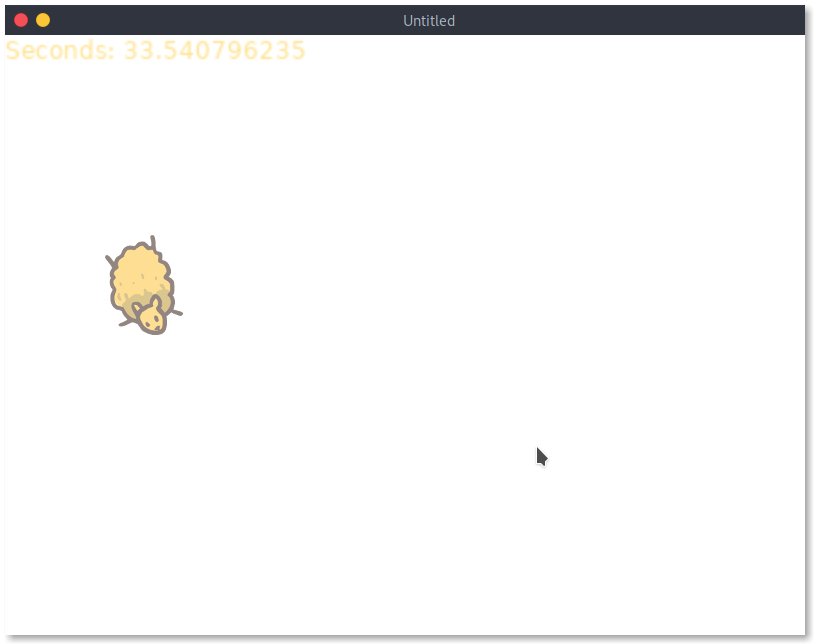

# How To LÖVE



### Windows

- Download Lua
  https://sourceforge.net/projects/luabinaries/files/5.4.2/Tools%20Executables/lua-5.4.2_Win64_bin.zip/download

- Download LÖVE
  https://github.com/love2d/love/releases/download/11.3/love-11.3-win64.exe

- run

```cmd
[Environment]::SetEnvironmentVariable("Path", $env:Path + ";C:\bin",[EnvironmentVariableTarget]::Machine)
```

> You will not see the result of this change until you start a new powershell session.

### Linux

- run

```sh
sudo apt install love
```

## Resources

- https://sheepolution.com/
